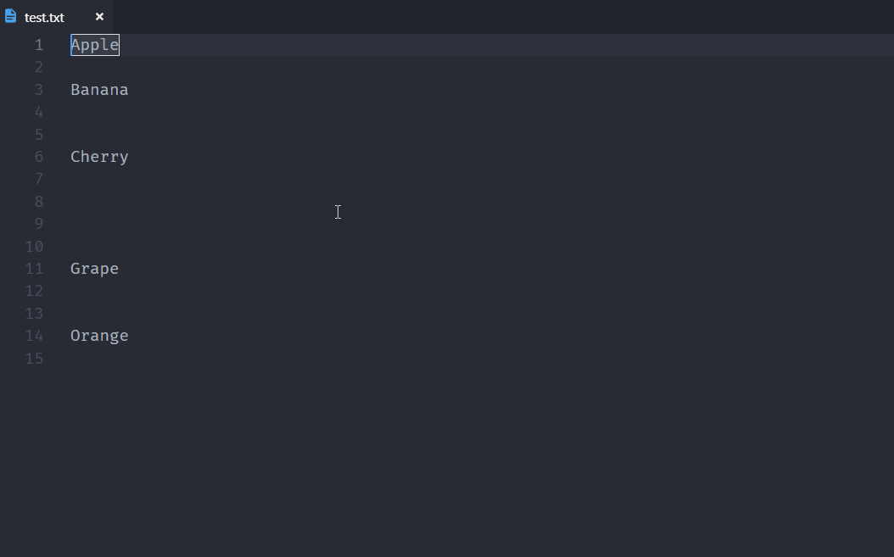
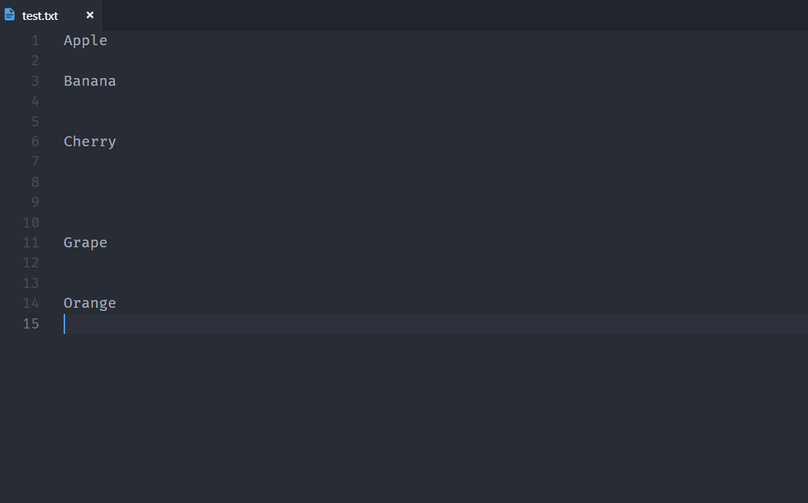

# Remove Blank Lines

   

The fastest way to remove empty lines from opened document.

## Features

### Shortcuts
- `Ctrl+Shift+A Ctrl+Shift+Z` to remove on selected text portions
- `Ctrl+Shift+Z Ctrl+Shift+A` to remove on opened document

### From All commands

Search `Remove Blank Lines` -> `In Selection`

Search `Remove Blank Lines` -> `In Document`

### Manage Extension Settings

File -> Preferences -> Settings -> Extension -> Remove Blank Lines -> Number of allowed consecutive empty lines

#### Remove blank lines in Selection

#### Remove blank lines in Document

## Requirements

VS Code - 1.35.0

## Release Notes

### v1.1.1 - 20-Jun-2019
- New Logo updated

### v1.1.0 - 20-Jun-2019

- Users can controll "Number of allowed consecutive empty lines" via extension settings.

### v1.0.0 - 19-Jun-2019

Initial Release

- Remove empty/blank lines on selected texts
- Remove empty/blank lines on opened document
- Shortcuts added
- Show deleted lines count on status bar
- In Document Demo Gif added on readme file
- In Selection Demo Gif added on readme file
